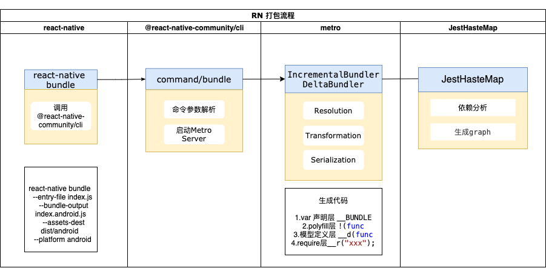
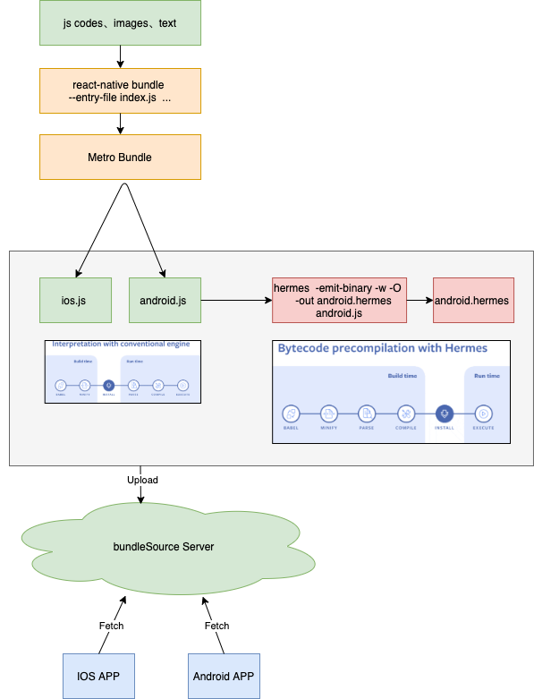

在了解了RN的框架理念后，我们先从RN的打包说起

## RN打包流程

## 引入Hermes流程

## 生成包分析

- var 声明层: 对当前运行环境, bundle 启动时间，以及进程相关信息;
- polyfill 层: !(function(r){}) , 定义了对 define（__d）、 require（__r）、clear（__c） 的支持，以及 module（react-native 及第三方 dependences 依赖的 module） 的加载逻辑;
- 模块定义层: __d 定义的代码块，包括 RN 框架源码 js 部分、自定义 js 代码部分、图片资源信息，供 require 引入使用
- require 层: r 定义的代码块，找到 d 定义的代码块 并执行

## 参考资料

[react-native-application-start](https://levelup.gitconnected.com/wait-what-happens-when-my-react-native-application-starts-an-in-depth-look-inside-react-native-5f306ef3250f)

[metro](https://facebook.github.io/metro/docs/concepts)

[react-native bundle](https://juejin.cn/post/6881420775723630600)

[hermes](https://hermesengine.dev/)

[Chain React 2019: Hermes Engine Announcement](https://www.youtube.com/watch?v=zEjqDWqeDdg)

[what-you-need-to-know-about-hermes](https://dev.to/godswillokokon/react-native-what-you-need-to-know-about-hermes-4lhn)

[getting-started-with-hermes-in-react-native](https://blog.logrocket.com/getting-started-with-hermes-in-react-native/?ref=morioh.com)

