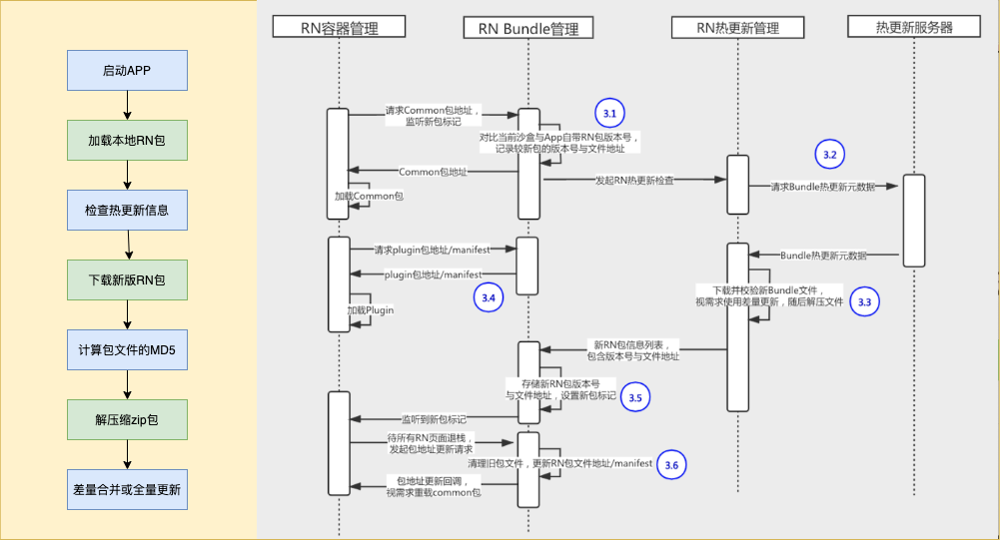

上一节我们学些了RN启动加载流程知道，RN会将JS代码打包成JSBundle文件，App加载JSBundle文件解析并渲染。由此可推出RN热更新的基本原理就是更换jsbundle文件，重新加载新的jsbundle资源即可。

## 主流的热更新方案

- 差量热更新: 对比代码变化，只更新有差异的部分
- 全量热更新: Pushy
- codepush: 微软方案

## 通用的热更新流程

## 热更新具体实现

分包: 将jsbundle做拆分，分为common + business

差分: 新老jsbundle做diff得出patch部分，客户端下载patch得出新的包。

## 参考资料

[RN hotreload](https://reactnative.dev/blog/2016/03/24/introducing-hot-reloading)
