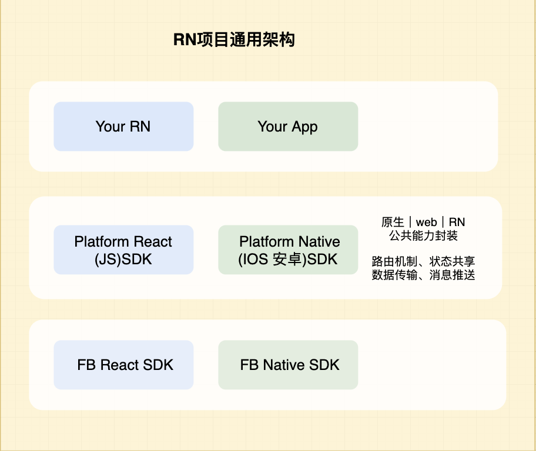

学习RN原理过程中，必然需要阅读RN源代码，我们先介绍下RN代码基础组织结构

##  React Native通用框架


##  React Native代码结构


##  React Native源码目录
```
├── Libraries // js sdk
│   ├── Alert
│   ├── Components
│   ├── EventEmitter
│   ├── Image
│   ├── NativeComponent
│   ├── NativeModules
│   ├── Network
│   ├── StyleSheet
│   ├── Text
│   ├── TurboModule
│   ├── .....
├── React // ios sdk
│   ├── Base
│   ├── CoreModules
│   ├── CxxBridge
│   ├── CxxModule
│   ├── CxxUtils
│   ├── Fabric
│   ├── Modules
│   ├── .....
├── ReactAndroid // android sdk
│   ├── build.gradle
│   ├── gradle.properties
│   ├── libs
│   ├── proguard-rules.pro
│   └── src
├── ReactCommon // c++ common
│   ├── React-Fabric.podspec
│   ├── ReactCommon.podspec
│   ├── cxxreact
│   ├── hermes
│   ├── jsengineinstance
│   ├── jsi
│   ├── jsiexecutor
│   ├── jsinspector
│   ├── libraries
│   ├── react
│   ├── runtimeexecutor
│   └── yoga
│   ├── .....
├── cli.js
├── package.json
├── third-party-podspecs //c++底层
│   ├── DoubleConversion.podspec
│   ├── RCT-Folly.podspec
│   ├── boost.podspec
│   └── glog.podspec
```


## 参考资料

[react-native](https://github.com/facebook/react-native)

