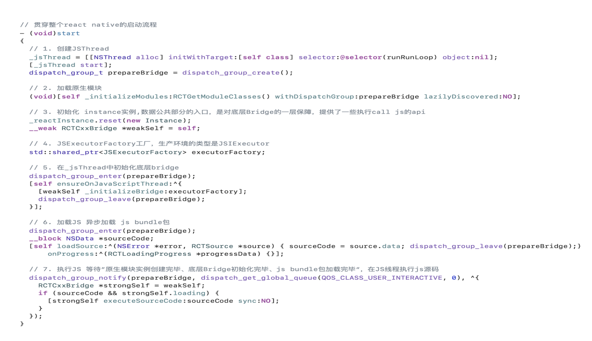
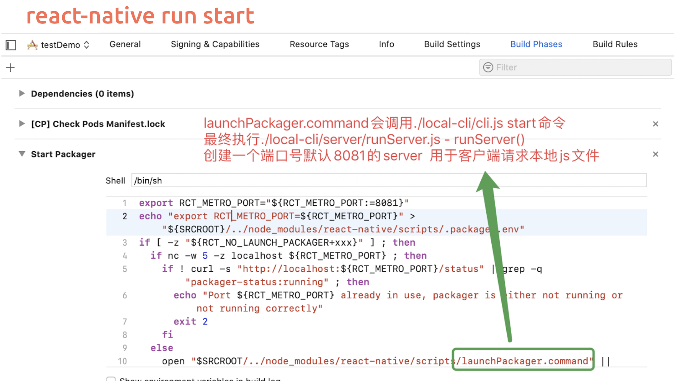
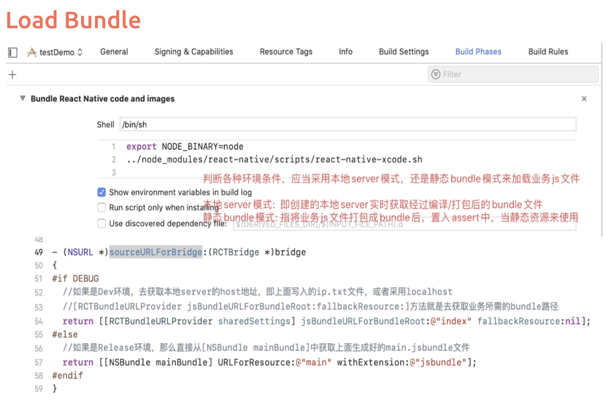

在上一章中我们了解了`ReactNative`的基本理念，分为JS模块\Bridge\Native模块，在前端代码会被打成一个JSBundle，客户端从CDN下载并加载JSBundle，创建一个JS的runtime运行环境，再将运行结果交给Native的相关的线程渲染。

那么一个JS的代码如何一步步加载进APP？本节我们一起来看看IOS里面是如何启动RN的。

## RN启动步骤

- start函数源代码

## Xcode配置
运行react-native run-ios

## 参考资料

[ReactNative架构](https://formidable.com/blog/2019/react-codegen-part-1/)

[How React Native works right now](https://www.freecodecamp.org/news/how-react-native-constructs-app-layouts-and-how-fabric-is-about-to-change-it-dd4cb510d055/)

[React Native架构一览](http://www.ayqy.net/blog/react-native-architecture-overview/)

